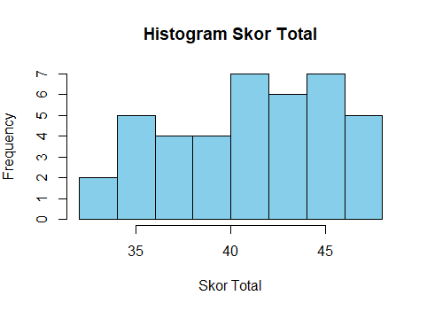
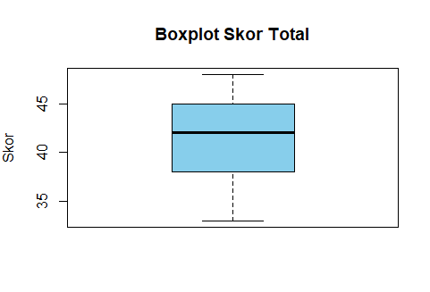
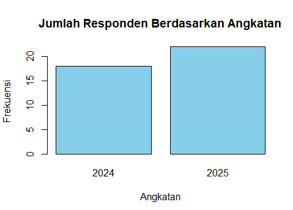
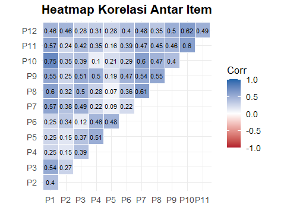

# Average Estimation of Social Media Utilization for Academic Information Using Two-Stage Cluster Sampling
# 📊 Estimasi Rata-Rata Pemanfaatan Media Sosial sebagai Sumber Informasi Akademik Mahasiswa Program Studi Statistika Universitas Mataram Menggunakan Two-Stage Cluster Sampling

## Deskripsi Proyek

Repository ini mendokumentasikan seluruh proses penelitian mengenai **estimasi rata-rata pemanfaatan media sosial sebagai sumber informasi akademik** pada mahasiswa Program Studi Statistika Universitas Mataram menggunakan metode **Two-Stage Cluster Sampling**. Penelitian ini bertujuan untuk memperoleh estimasi rata-rata pemanfaatan media sosial berdasarkan data hasil survei yang dikumpulkan melalui penyebaran kuesioner kepada responden terpilih.

Proses pengambilan sampel dilakukan dalam dua tahap. Tahap pertama menggunakan **Cluster Sampling** dengan kelas sebagai klaster, sedangkan tahap kedua menggunakan **Simple Random Sampling (SRS)** untuk memilih mahasiswa pada klaster yang terpilih. Sebelum pengumpulan data utama, instrumen penelitian terlebih dahulu diuji validitas dan reliabilitas menggunakan data hasil uji coba (pilot test) yang melibatkan responden di luar sampel penelitian. Seluruh proses analisis data dilakukan menggunakan bahasa pemrograman **R**.

Repository ini menyajikan dokumentasi penelitian secara sistematis, mulai dari proses pengambilan sampel, pengolahan data, pengujian validitas dan reliabilitas instrumen, analisis statistik deskriptif, visualisasi data, pembobotan **Two-Stage Cluster Sampling**, hingga analisis survei untuk memperoleh estimasi rata-rata beserta ukuran ketelitian estimasi. Repository ini diharapkan dapat menjadi referensi dalam penerapan metode **Two-Stage Cluster Sampling** pada penelitian survei, khususnya dalam bidang statistika.

---

## Struktur Repository

```text
Estimasi-Rata-Rata-Pemanfaatan-Media-Sosial/
├── README.md
├── Executive_Summary.pdf
├── data/
│   ├── Data_Penelitian.xlsx
│   └── Randomisasi_Two_Stage_Cluster_Sampling.xlsx
├── script/
│   └── Analisis_Two_Stage_Cluster_Sampling.R
└── output_gambar/
    ├── Histogram_Skor_Total.png
    ├── Boxplot_Skor_Total.png
    ├── Bar_Angkatan.png
    ├── Bar_Jenis_Kelamin.png
    └── Heatmap_Korelasi_Item.png
```

---

Keterangan Struktur Repository

- **README.md** : Dokumentasi lengkap penelitian yang memuat latar belakang, metodologi, tahapan analisis, hasil, dan kesimpulan.
- **Executive_Summary.pdf** : Ringkasan penelitian yang mencakup tujuan, metode, hasil utama, dan kesimpulan.
- **data/** : Berisi data yang digunakan dalam penelitian, meliputi data hasil pengumpulan kuesioner serta hasil randomisasi kelas pada tahap pertama **Two-Stage Cluster Sampling**.
- **script/** : Berisi seluruh sintaks R yang digunakan untuk proses pengolahan dan analisis data, mulai dari import data, uji validitas, uji reliabilitas, analisis statistik deskriptif, visualisasi data, pembobotan **Two-Stage Cluster Sampling**, hingga analisis survei untuk memperoleh estimasi rata-rata.
- **output_gambar/** : Berisi visualisasi dan output hasil analisis, seperti histogram, boxplot, diagram batang, diagram lingkaran, serta grafik lain yang digunakan untuk mendukung interpretasi hasil penelitian.

---

## Daftar Isi

- [Deskripsi Proyek](#deskripsi-proyek)
- [Struktur Repository](#struktur-repository)
- [Latar Belakang](#latar-belakang)
- [Tujuan Penelitian](#tujuan-penelitian)
- [Metodologi Penelitian](#metodologi-penelitian)
- [Alur Analisis](#alur-analisis)
- [Langkah Analisis](#langkah-analisis)
- [Hasil dan Pembahasan](#hasil-dan-pembahasan)
- [Kesimpulan](#kesimpulan)
- [Rekomendasi](#rekomendasi)
- [Link Kuesioner](#link-kuesioner)

---

## Latar Belakang

Perkembangan teknologi informasi telah mendorong media sosial menjadi salah satu sarana yang banyak dimanfaatkan oleh mahasiswa, tidak hanya sebagai media komunikasi dan hiburan, tetapi juga sebagai sumber informasi akademik. Mahasiswa memanfaatkan media sosial untuk memperoleh materi perkuliahan, referensi belajar, informasi seminar, webinar, serta berbagai kegiatan akademik lainnya.

Pemanfaatan media sosial sebagai sumber informasi akademik dapat berbeda pada setiap mahasiswa. Oleh karena itu, diperlukan suatu survei untuk memperoleh gambaran mengenai rata-rata pemanfaatan media sosial sebagai sumber informasi akademik pada mahasiswa Program Studi Statistika Universitas Mataram.

Penelitian ini menggunakan metode **Two-Stage Cluster Sampling** untuk memperoleh sampel secara efisien. Tahap pertama dilakukan dengan memilih kelas sebagai klaster, sedangkan tahap kedua dilakukan dengan memilih mahasiswa secara acak dari kelas yang terpilih. Hasil penelitian diharapkan dapat memberikan estimasi rata-rata pemanfaatan media sosial sebagai sumber informasi akademik pada mahasiswa Program Studi Statistika Universitas Mataram.

---

## Tujuan Penelitian

Penelitian ini bertujuan untuk:

- Mengestimasi rata-rata pemanfaatan media sosial sebagai sumber informasi akademik pada mahasiswa Program Studi Statistika Universitas Mataram menggunakan metode **Two-Stage Cluster Sampling**.
- Menguji validitas dan reliabilitas instrumen penelitian sebelum digunakan pada pengumpulan data utama.
- Mendeskripsikan karakteristik data menggunakan analisis statistik deskriptif dan visualisasi data.
- Menghitung bobot sampel berdasarkan desain **Two-Stage Cluster Sampling**.
- Melakukan analisis survei untuk memperoleh estimasi rata-rata beserta ukuran ketelitian estimasi, seperti **Standard Error (SE)** dan **Confidence Interval (CI)**.
---

## Metodologi Penelitian

### Jenis Penelitian

Penelitian ini merupakan penelitian survei dengan pendekatan kuantitatif yang bertujuan untuk mengestimasi rata-rata pemanfaatan media sosial sebagai sumber informasi akademik pada mahasiswa Program Studi Statistika Universitas Mataram. Penelitian menggunakan metode **Two-Stage Cluster Sampling** sebagai teknik pengambilan sampel sehingga setiap mahasiswa memiliki peluang yang diketahui untuk terpilih sebagai responden.

### Populasi dan Sampel

Populasi dalam penelitian ini adalah mahasiswa Program Studi Statistika Universitas Mataram yang berada pada dua kelas hasil pengacakan pada tahap pertama, yaitu **kelas 24A** dan **kelas 25A**, dengan jumlah populasi sebanyak **66 mahasiswa**.

Setelah dua kelas terpilih, seluruh mahasiswa pada kedua kelas tersebut dijadikan kerangka sampel. Selanjutnya dilakukan pengambilan sampel mahasiswa secara **Simple Random Sampling (SRS)** sehingga setiap mahasiswa memiliki peluang yang sama untuk terpilih sebagai responden.

Jumlah sampel ditentukan menggunakan rumus Slovin dengan tingkat kesalahan (error) sebesar **10%**.

Rumus Slovin:

n = N / (1 + N × e²)

Keterangan:
- N = 66 (jumlah populasi)
- e = 0,10

Perhitungan:

n = 66 / (1 + 66 × 0,10²)

= 66 / (1 + 66 × 0,01)

= 66 / (1 + 0,66)

= 66 / 1,66

= 39,76 ≈ 40

Berdasarkan hasil perhitungan tersebut, jumlah sampel yang digunakan dalam penelitian ini adalah **40 responden**.

### Teknik Sampling

Penelitian ini menggunakan metode **Two-Stage Cluster Sampling** yang dilakukan melalui dua tahap.

- **Tahap pertama (Cluster Sampling)** dilakukan dengan mengacak enam kelas aktif mahasiswa Program Studi Statistika Universitas Mataram menggunakan fungsi `RAND()` pada Microsoft Excel. Hasil pengacakan menghasilkan dua kelas terpilih, yaitu **24A** dan **25A**.
- **Tahap kedua (Simple Random Sampling)** dilakukan dengan memilih mahasiswa secara acak sederhana dari kedua kelas terpilih hingga diperoleh **40 responden** sebagai sampel penelitian.

### Instrumen Penelitian

Instrumen penelitian berupa kuesioner yang terdiri atas **12 butir pernyataan** mengenai pemanfaatan media sosial sebagai sumber informasi akademik dengan menggunakan skala Likert 1–4, yaitu:

| Jawaban | Skor |
|----------|:----:|
| Sangat Tidak Setuju (STS) | 1 |
| Tidak Setuju (TS) | 2 |
| Setuju (S) | 3 |
| Sangat Setuju (SS) | 4 |

Sebelum digunakan pada pengumpulan data utama, instrumen terlebih dahulu diuji coba kepada **10 mahasiswa di luar sampel penelitian**. Data hasil uji coba dianalisis menggunakan perangkat lunak **R** untuk menguji validitas dan reliabilitas instrumen. Hasil analisis menunjukkan bahwa seluruh butir pernyataan dinyatakan **valid dan reliabel**, sehingga instrumen layak digunakan pada penelitian utama. Hasil lengkap uji validitas dan uji reliabilitas disajikan pada bagian **Lampiran**.

### Variabel Penelitian

Penelitian ini memiliki satu variabel, yaitu **pemanfaatan media sosial sebagai sumber informasi akademik** pada mahasiswa Program Studi Statistika Universitas Mataram. Variabel tersebut diukur menggunakan kuesioner yang terdiri atas 12 butir pernyataan dengan 4 indikator serta skala Likert 1–4, yaitu:

| Indikator | Kode | Pernyataan |
|-----------|------|------------|
| **Intensitas Pemanfaatan Media Sosial** | P1 | Saya menggunakan media sosial untuk mencari informasi yang berkaitan dengan perkuliahan. |
| | P2 | Saya memanfaatkan media sosial untuk memperoleh materi atau referensi belajar. |
| | P3 | Saya mengikuti akun atau komunitas media sosial yang membagikan informasi akademik. |
| **Kemudahan Memperoleh Informasi Akademik** | P4 | Media sosial memudahkan saya memperoleh informasi akademik dengan cepat. |
| | P5 | Saya mudah menemukan informasi mengenai seminar, webinar, atau kegiatan akademik melalui media sosial. |
| | P6 | Media sosial membantu saya memperoleh informasi akademik kapan saja ketika dibutuhkan. |
| **Manfaat bagi Kegiatan Akademik** | P7 | Informasi akademik yang saya peroleh melalui media sosial membantu saya memahami materi perkuliahan. |
| | P8 | Media sosial membantu saya memperoleh referensi dalam menyelesaikan tugas kuliah. |
| | P9 | Media sosial mendukung proses belajar saya selama mengikuti perkuliahan. |
| **Kepercayaan dan Efektivitas Informasi** | P10 | Saya memeriksa kembali kebenaran informasi akademik yang diperoleh dari media sosial. |
| | P11 | Informasi akademik yang saya peroleh melalui media sosial umumnya dapat dipercaya. |
| | P12 | Secara keseluruhan, media sosial merupakan sumber informasi akademik yang bermanfaat bagi saya. |

Seluruh pernyataan diukur menggunakan skala Likert 1–4 dengan kategori **1 = Sangat Tidak Setuju (STS), 2 = Tidak Setuju (TS), 3 = Setuju (S), dan 4 = Sangat Setuju (SS)**. Skor dari setiap butir dijumlahkan untuk memperoleh skor total yang digunakan dalam proses analisis.

### Teknik Pengumpulan Data

Pengumpulan data dilakukan melalui penyebaran kuesioner secara daring menggunakan **Google Form** kepada responden yang telah terpilih sebagai sampel penelitian. Data yang terkumpul kemudian diekspor ke dalam format Microsoft Excel dan dianalisis menggunakan bahasa pemrograman **R** sesuai dengan tahapan analisis yang telah direncanakan.

---

## Alur Analisis

```text
Import Data
      │
      ▼
Pengolahan Data
      │
      ▼
Menyiapkan Variabel Penelitian
      │
      ▼
Data Cleaning
      │
      ▼
Uji Validitas
      │
      ▼
Uji Reliabilitas
      │
      ▼
Analisis Statistik Deskriptif
      │
      ▼
Visualisasi Data
      │
      ▼
Pembobotan Two-Stage Cluster Sampling
      │
      ▼
Analisis Survei
      │
      ▼
Estimasi Rata-rata, Standard Error (SE),
Confidence Interval (CI), Design Effect (DEFF),
dan Relative Standard Error (RSE)
```

---

## Langkah Analisis

Tahapan analisis dilakukan menggunakan bahasa pemrograman **R**. Setiap tahapan dijelaskan secara ringkas pada bagian berikut. **Script lengkap** dapat dilihat pada file **`script/Analisis_Two_Stage_Cluster_Sampling.R`** yang tersedia pada repository ini.

---

## 1. Import Data

### Tujuan

Mengimpor data hasil kuesioner ke dalam R dan memeriksa struktur awal data sebelum dilakukan analisis.

### Syntax

```r
library(readxl)

data <- read_excel("Data Responden Utama.xlsx")

str(data)

head(data)
```

### Penjelasan

Data diimpor menggunakan package **readxl**, kemudian dilakukan pemeriksaan struktur data dan enam observasi pertama untuk memastikan data berhasil dibaca dengan benar.

> **Catatan:** Script lengkap proses import data dapat dilihat pada folder **`script/Analisis_Two_Stage_Cluster_Sampling.R`**.

---

## 2. Pengolahan Data

### Tujuan

Menyiapkan data agar seluruh item pertanyaan dapat dianalisis sebagai data numerik.

### Syntax

```r
item <- data[,6:17]

item <- data.frame(
  lapply(item, function(x)
    as.numeric(as.character(x)))
)

data[,6:17] <- item
```

### Penjelasan

Tahap ini memilih 12 butir pertanyaan penelitian kemudian mengubah seluruh jawaban menjadi data numerik sehingga dapat digunakan pada proses analisis statistik.

> **Catatan:** Script lengkap tersedia pada **`script/Analisis_Two_Stage_Cluster_Sampling.R`**.

---

## 3. Menyiapkan Variabel Penelitian

### Tujuan

Membentuk variabel yang digunakan pada proses analisis.

### Syntax

```r
data$Skor_Total <- rowSums(item)

data$Kelas <- as.factor(data$Kelas)

data$Angkatan <- as.factor(data$Angkatan)
```

### Penjelasan

Pada tahap ini dihitung skor total setiap responden serta mengubah variabel kategorik menjadi faktor agar sesuai dengan kebutuhan analisis survei.

> **Catatan:** Script lengkap tersedia pada **`script/Analisis_Two_Stage_Cluster_Sampling.R`**.

---

## 4. Data Cleaning

### Tujuan

Memastikan kualitas data sebelum dilakukan analisis statistik.

### Syntax

```r
jumlah_responden <- nrow(data)

missing_value <- sum(is.na(data))

duplikat <- sum(duplicated(data))

Q1 <- quantile(data$Skor_Total,0.25)
Q3 <- quantile(data$Skor_Total,0.75)
```

### Penjelasan

Pemeriksaan dilakukan terhadap jumlah responden, missing value, data duplikat, dan outlier menggunakan metode **Interquartile Range (IQR)** sehingga data yang dianalisis memenuhi kualitas yang baik.

> **Catatan:** Script lengkap tersedia pada **`script/Analisis_Two_Stage_Cluster_Sampling.R`**.

---

## 5. Uji Validitas

### Tujuan

Mengetahui kemampuan setiap butir pertanyaan dalam mengukur variabel penelitian.

### Syntax

```r
for(i in 1:ncol(item)){

  skor_total_koreksi <- rowSums(item[,-i])

  hasil <- cor.test(item[,i], skor_total_koreksi)

}
```

### Penjelasan

Validitas setiap item diuji menggunakan korelasi Pearson antara skor item dengan skor total terkoreksi (Corrected Item-Total Correlation).

> **Catatan:** Script lengkap tersedia pada **`script/Analisis_Two_Stage_Cluster_Sampling.R`**.

---

## 6. Uji Reliabilitas

### Tujuan

Mengukur tingkat konsistensi instrumen penelitian.

### Syntax

```r
library(psych)

hasil_alpha <- alpha(item)
```

### Penjelasan

Uji reliabilitas dilakukan menggunakan koefisien **Cronbach's Alpha**. Instrumen dinyatakan reliabel apabila nilai Alpha ≥ 0,70.

> **Catatan:** Script lengkap tersedia pada **`script/Analisis_Two_Stage_Cluster_Sampling.R`**.

---

## 7. Analisis Statistik Deskriptif

### Tujuan

Memberikan gambaran umum mengenai karakteristik data penelitian.

### Syntax

```r
summary(data$Skor_Total)

mean(data$Skor_Total)

sd(data$Skor_Total)
```

### Penjelasan

Statistik deskriptif digunakan untuk melihat ukuran pemusatan dan penyebaran data sebelum dilakukan analisis survei.

> **Catatan:** Script lengkap tersedia pada **`script/Analisis_Two_Stage_Cluster_Sampling.R`**.

---

## 8. Visualisasi Data

### Tujuan

Menyajikan distribusi data dan hubungan antar item secara visual.

### Syntax

```r
hist(data$Skor_Total)

boxplot(data$Skor_Total)

ggcorrplot(korelasi)
```

### Penjelasan

Visualisasi dilakukan menggunakan histogram, boxplot, bar chart, dan heatmap korelasi sehingga karakteristik data lebih mudah dipahami.

> **Catatan:** Script lengkap tersedia pada **`script/Analisis_Two_Stage_Cluster_Sampling.R`**.

---

## 9. Pembobotan Two-Stage Cluster Sampling

### Tujuan

Menghitung bobot setiap responden berdasarkan peluang pemilihannya.

### Syntax

```r
p1 <- m/M

p2 <- n/N

w_akhir <- (1/(p1*p2))
```

### Penjelasan

Bobot dihitung berdasarkan peluang pemilihan pada tahap pertama dan tahap kedua sehingga setiap responden dapat mewakili unit dalam populasi.

> **Catatan:** Script lengkap tersedia pada **`script/Analisis_Two_Stage_Cluster_Sampling.R`**.

---

## 10. Analisis Survei

### Tujuan

Mengestimasi rata-rata pemanfaatan media sosial sebagai sumber informasi akademik beserta ukuran ketelitiannya.

### Syntax

```r
desain <- svydesign(
  ids = ~Cluster,
  weights = ~bobot,
  data = data
)

hasil <- svymean(~Skor_Total, desain)

SE(hasil)

confint(hasil)
```

### Penjelasan

Analisis dilakukan menggunakan package **survey** untuk memperoleh estimasi rata-rata, Standard Error (SE), Confidence Interval (CI), Design Effect (DEFF), dan Relative Standard Error (RSE).

> **Catatan:** Script lengkap tersedia pada **`script/Analisis_Two_Stage_Cluster_Sampling.R`**.
---

## Hasil dan Pembahasan

### 1. Hasil Import Data

Data hasil pengumpulan kuesioner berhasil diimpor ke dalam R menggunakan package **readxl**. Dataset yang digunakan terdiri atas **40 responden** dengan **17 variabel**, yaitu 5 variabel identitas responden dan 12 butir pertanyaan mengenai pemanfaatan media sosial sebagai sumber informasi akademik.

#### Informasi Dataset

| Komponen | Keterangan |
|----------|------------|
| Jumlah Responden | 40 |
| Jumlah Variabel | 17 |
| Tipe Data | `tibble` (`tbl_df`) |
| Variabel Identitas | Timestamp, Nama Lengkap, Angkatan, Kelas, Jenis Kelamin |
| Variabel Penelitian | 12 butir pertanyaan skala Likert (1–4) |

#### Enam Data Pertama

| No | Nama Lengkap | Angkatan | Kelas | Jenis Kelamin |
|---:|--------------|:--------:|:-----:|:-------------:|
| 1 | Yani Ofa Salika | 2024 | A | Perempuan |
| 2 | Hurul Aini | 2024 | A | Perempuan |
| 3 | Meylisa Azzahra | 2024 | A | Perempuan |
| 4 | Nurlinda Suryani | 2024 | A | Perempuan |
| 5 | Laula Faokana | 2024 | A | Perempuan |
| 6 | Ni Putu Adelina Devani | 2024 | A | Perempuan |

**Struktur Data**

Struktur data digunakan untuk mengetahui tipe data dari setiap variabel yang terdapat dalam dataset penelitian sebelum dilakukan proses analisis.

| Variabel | Tipe Data | Keterangan |
|----------|-----------|------------|
| Timestamp | POSIXct | Waktu pengisian kuesioner |
| Nama Lengkap | character | Nama responden |
| Angkatan | numeric | Tahun angkatan responden |
| Kelas | character | Kelas responden |
| Jenis Kelamin | character | Jenis kelamin responden |
| Item 1–12 | numeric | Skor jawaban kuesioner menggunakan skala Likert 1–4 |

**Interpretasi**

Hasil import data menunjukkan bahwa dataset berhasil diimpor ke dalam R tanpa kendala. Dataset terdiri atas **40 responden** dan **17 variabel**, yang meliputi **1 variabel bertipe tanggal dan waktu (POSIXct)**, **3 variabel bertipe karakter (character)**, dan **13 variabel bertipe numerik (numeric)**. Variabel numerik terdiri atas satu variabel identitas, yaitu **Angkatan**, serta **12 butir pertanyaan** yang diukur menggunakan skala Likert 1–4. Seluruh variabel telah terbaca dengan baik sehingga dapat langsung digunakan dalam analisis statistik, seperti uji validitas, uji reliabilitas, analisis statistik deskriptif, pembobotan, dan analisis survei.

### 2. Hasil Pengolahan Data

Tahap pengolahan data dilakukan untuk mempersiapkan data sebelum memasuki proses analisis. Kegiatan yang dilakukan meliputi pemilihan butir pertanyaan penelitian dan konversi tipe data seluruh item menjadi numerik agar dapat diolah menggunakan metode statistik.

| Pengolahan Data | Hasil |
|-----------------|-------|
| Jumlah item penelitian | 12 butir pertanyaan |
| Konversi tipe data | Seluruh item berhasil dikonversi menjadi `numeric` |
| Rentang skala jawaban | 1–4 (Skala Likert) |
| Status data | Data siap digunakan pada tahap penyiapan variabel penelitian |

**Interpretasi**

Hasil pengolahan data menunjukkan bahwa seluruh butir pertanyaan penelitian berhasil dipilih dan dikonversi ke dalam tipe data numerik. Konversi ini dilakukan agar setiap respons dapat diolah menggunakan berbagai analisis statistik, seperti perhitungan skor total, uji validitas, uji reliabilitas, analisis statistik deskriptif, pembobotan, dan analisis survei.

### 3. Hasil Penyiapan Variabel Penelitian

Tahap penyiapan variabel penelitian dilakukan untuk membentuk variabel yang akan digunakan dalam proses analisis. Kegiatan yang dilakukan meliputi perhitungan skor total setiap responden serta penyesuaian tipe data pada variabel kategorik agar sesuai dengan kebutuhan analisis statistik.

| Variabel | Hasil |
|----------|-------|
| Skor_Total | Berhasil dihitung dari penjumlahan 12 butir pertanyaan |
| Angkatan | Berhasil diubah menjadi tipe `factor` |
| Kelas | Berhasil diubah menjadi tipe `factor` |
| Jenis Kelamin | Berhasil diubah menjadi tipe `factor` |
| Status Variabel | Siap digunakan pada tahap analisis selanjutnya |

**Interpretasi**

Hasil penyiapan variabel penelitian menunjukkan bahwa variabel **Skor_Total** berhasil dibentuk sebagai penjumlahan skor dari 12 butir pertanyaan yang mengukur pemanfaatan media sosial sebagai sumber informasi akademik. Variabel **Angkatan**, **Kelas**, dan **Jenis Kelamin** juga telah dikonversi menjadi tipe **factor** sehingga sesuai untuk analisis data kategorik dan pembentukan desain survei pada metode **Two-Stage Cluster Sampling**. Seluruh variabel penelitian telah siap digunakan pada tahap data cleaning dan analisis berikutnya.

### 4. Hasil Data Cleaning

Tahap data cleaning dilakukan untuk memastikan bahwa data yang digunakan telah memenuhi kualitas yang diperlukan sebelum memasuki tahap analisis statistik. Pemeriksaan meliputi jumlah responden, keberadaan missing value, data duplikat, serta outlier menggunakan metode Interquartile Range (IQR).

| Pemeriksaan | Hasil |
|-------------|-------|
| Jumlah Responden | 40 |
| Missing Value | 0 |
| Data Duplikat | 0 |
| Outlier (Metode IQR) | 0 |
| Status Data | Data siap dianalisis |

**Interpretasi**

Hasil data cleaning menunjukkan bahwa dataset terdiri atas **40 responden** dengan kualitas data yang baik. Pemeriksaan menunjukkan tidak terdapat **missing value**, **data duplikat**, maupun **outlier** berdasarkan metode **Interquartile Range (IQR)**. Seluruh data memenuhi kriteria kelayakan sehingga tidak diperlukan proses penghapusan maupun perbaikan data. Dengan demikian, dataset dinyatakan siap digunakan pada tahap uji validitas, uji reliabilitas, analisis statistik deskriptif, pembobotan Two-Stage Cluster Sampling, dan analisis survei.

### 5. Hasil Uji Validitas

Uji validitas dilakukan untuk mengetahui apakah setiap butir pertanyaan mampu mengukur konstruk penelitian dengan menggunakan korelasi Pearson antara skor item dan skor total.

| Item | r hitung | p-value | Keputusan |
|------|----------|---------|-----------|
| P1 | 0.776 | < 0.001 | Valid |
| P2 | 0.537 | 0.0003 | Valid |
| P3 | 0.667 | < 0.001 | Valid |
| P4 | 0.570 | 0.0001 | Valid |
| P5 | 0.472 | 0.0021 | Valid |
| P6 | 0.611 | < 0.001 | Valid |
| P7 | 0.713 | < 0.001 | Valid |
| P8 | 0.705 | < 0.001 | Valid |
| P9 | 0.746 | < 0.001 | Valid |
| P10 | 0.725 | < 0.001 | Valid |
| P11 | 0.718 | < 0.001 | Valid |
| P12 | 0.701 | < 0.001 | Valid |

**Interpretasi**

Hasil uji validitas menunjukkan bahwa seluruh butir pertanyaan (P1–P12) memiliki nilai korelasi positif dengan skor total. Nilai r hitung berada pada rentang 0.472 hingga 0.776 dengan seluruh p-value < 0.05. Hal ini menunjukkan bahwa setiap item mampu mengukur konstruk penelitian secara konsisten sehingga seluruh instrumen dinyatakan valid dan layak digunakan untuk analisis lanjutan.

### 6. Hasil Uji Reliabilitas

Uji reliabilitas dilakukan untuk mengetahui tingkat konsistensi internal instrumen penelitian menggunakan koefisien Cronbach’s Alpha.

| Indikator | Nilai |
|-----------|-------|
| Cronbach’s Alpha | 0.883 |
| Kriteria | ≥ 0.70 |
| Keputusan | Reliabel |

**Interpretasi**

Hasil uji reliabilitas menunjukkan bahwa nilai Cronbach’s Alpha sebesar 0.883. Nilai tersebut lebih besar dari batas minimum 0.70 sehingga instrumen penelitian dinyatakan memiliki konsistensi internal yang baik. Dengan demikian, seluruh butir pertanyaan pada kuesioner dinyatakan reliabel dan layak digunakan untuk analisis lebih lanjut.

### 7. Hasil Analisis Statistik Deskriptif

Analisis statistik deskriptif dilakukan untuk memberikan gambaran umum mengenai distribusi skor pemanfaatan media sosial sebagai sumber informasi akademik pada responden penelitian.

| Statistik | Nilai |
|-----------|-------:|
| Jumlah Responden | 40 |
| Rata-rata (Mean) | 41.65 |
| Median | 42.00 |
| Simpangan Baku (Standard Deviation) | 4.24 |
| Nilai Minimum | 33 |
| Kuartil 1 (Q1) | 38 |
| Kuartil 3 (Q3) | 45 |
| Nilai Maksimum | 48 |
| Rentang (Range) | 33–48 |

**Interpretasi**

Hasil analisis statistik deskriptif menunjukkan bahwa rata-rata skor pemanfaatan media sosial sebagai sumber informasi akademik sebesar **41.65** dengan nilai tengah (median) sebesar **42.00**. Nilai rata-rata yang hampir sama dengan median menunjukkan bahwa sebaran skor responden relatif seimbang dan tidak mengalami penyimpangan yang besar.

Simpangan baku sebesar **4.24** menunjukkan bahwa variasi skor antarresponden tergolong relatif rendah sehingga sebagian besar responden memiliki tingkat pemanfaatan media sosial yang tidak jauh berbeda dari rata-ratanya. Skor terendah yang diperoleh responden adalah **33**, sedangkan skor tertinggi mencapai **48**, dengan rentang nilai antara **33–48**. Berdasarkan hasil tersebut, secara umum responden memiliki tingkat pemanfaatan media sosial yang cenderung tinggi sebagai sumber informasi akademik.

### 8. Hasil Visualisasi Data

Visualisasi data dilakukan untuk memberikan gambaran mengenai distribusi skor responden, karakteristik responden, serta hubungan antarbutir pertanyaan pada instrumen penelitian.

#### Histogram Skor Total



**Interpretasi**

Histogram menunjukkan bahwa skor total pemanfaatan media sosial sebagai sumber informasi akademik berada pada rentang 33 hingga 48. Sebagian besar responden memiliki skor pada kisaran 40–46, sehingga distribusi data cenderung terkonsentrasi pada nilai yang relatif tinggi. Sebaran data tidak menunjukkan pola ekstrem, sehingga mengindikasikan bahwa tingkat pemanfaatan media sosial sebagai sumber informasi akademik berada pada kategori cukup tinggi.

---

#### Boxplot Skor Total



**Interpretasi**

Boxplot menunjukkan median skor berada di sekitar nilai 42 dengan rentang interkuartil (IQR) sekitar 38 hingga 45. Tidak ditemukan nilai yang berada di luar whisker sehingga tidak terdapat indikasi outlier. Hal ini menunjukkan bahwa data relatif homogen dan layak digunakan untuk analisis lanjutan.

---

#### Diagram Batang Berdasarkan Angkatan



**Interpretasi**

Diagram batang menunjukkan bahwa responden didominasi oleh mahasiswa **perempuan**, yaitu sebanyak **36 orang (90%)**, sedangkan responden **laki-laki** berjumlah **4 orang (10%)**. Perbedaan proporsi tersebut menunjukkan bahwa karakteristik sampel penelitian lebih banyak berasal dari mahasiswa perempuan. Meskipun demikian, seluruh responden tetap digunakan dalam analisis sesuai dengan hasil pengambilan sampel menggunakan metode **Two-Stage Cluster Sampling**.

---

#### Heatmap Korelasi Antar Item



**Interpretasi**

Heatmap menunjukkan bahwa semua pertanyaan saling berhubungan dan memiliki arah hubungan yang sama, yaitu positif. Artinya, jika nilai pada satu pertanyaan meningkat, maka pertanyaan lainnya juga cenderung ikut meningkat. Hubungan antar item berada pada tingkat rendah hingga sedang, sehingga setiap pertanyaan masih memberikan informasi yang berbeda tetapi tetap saling mendukung dalam mengukur pemanfaatan media sosial sebagai sumber informasi akademik.

### 9. Hasil Pembobotan Two-Stage Cluster Sampling

### Hasil

| Komponen | Nilai |
|----------|------|
| Jumlah Klaster Populasi (M) | 6 |
| Klaster Sampel (m) | 2 |
| Jumlah Anggota Klaster Populasi (N) | 66 |
| Sampel Responden (n) | 40 |
| Responden Valid (nr) | 40 |
| Peluang Tahap 1 (p1) | 0.3333 |
| Peluang Tahap 2 (p2) | 0.6061 |
| Peluang Total | 0.2020 |
| Bobot Akhir (w_akhir) | 4.95 |

### Interpretasi

Hasil perhitungan menunjukkan bahwa setiap responden memiliki bobot sebesar **4,95**. Artinya, satu responden dalam penelitian ini mewakili sekitar 5 orang dalam populasi berdasarkan desain pengambilan sampel yang digunakan.

Karena seluruh responden yang terpilih berhasil mengisi kuesioner tanpa ada data yang hilang, maka tidak dilakukan penyesuaian non-respon. Dengan demikian, bobot akhir sama dengan bobot dasar yang diperoleh dari peluang pemilihan sampel.

### 10. Hasil Analisis Survei

Analisis dilakukan menggunakan desain **survey berbobot (Two-Stage Cluster Sampling)** dengan mempertimbangkan struktur klaster dan bobot sampel.

| Indikator | Nilai |
|----------|------|
| Estimasi Rata-rata | 41.65 |
| Standard Error (SE) | 1.985 |
| Confidence Interval 95% | 37.76 – 45.54 |
| Design Effect (DEFF) | 10.987 |
| Relative Standard Error (RSE) | 4.77% |

---

### Interpretasi

Hasil analisis menunjukkan bahwa rata-rata pemanfaatan media sosial sebagai sumber informasi akademik adalah **41,65**.

Nilai **Standard Error (1,985)** menunjukkan bahwa tingkat ketidakpastian estimasi masih dalam batas yang wajar, sehingga hasil rata-rata dapat dianggap cukup stabil.

Interval kepercayaan 95% berada pada rentang **37,76 sampai 45,54**, yang berarti nilai rata-rata populasi diperkirakan berada di dalam rentang tersebut.

Nilai **Design Effect (10,987)** menunjukkan bahwa varians data pada desain cluster sampling lebih besar dibandingkan dengan sampling acak sederhana, yang merupakan hal umum dalam desain survei berklaster.

Nilai **Relative Standard Error (4,77%)** berada di bawah 5%, sehingga menunjukkan bahwa hasil estimasi memiliki tingkat presisi yang sangat baik.

### Interpretasi Estimasi Rata-rata

Berdasarkan hasil analisis kualitas estimasi, diperoleh nilai rata-rata pemanfaatan media sosial sebagai sumber informasi akademik sebesar 41,65 yang menunjukkan bahwa rata-rata skor pemanfaatan media sosial mahasiswa setelah memperhitungkan bobot sampling berada pada angka tersebut. Nilai Standard Error sebesar 1,985 mengindikasikan bahwa tingkat kesalahan estimasi relatif kecil sehingga rata-rata yang diperoleh cukup stabil. Confidence Interval 95% berada pada rentang 37,76 hingga 45,54, yang berarti rata-rata skor pemanfaatan media sosial mahasiswa pada populasi diperkirakan berada dalam interval tersebut dengan tingkat kepercayaan sebesar 95%. Nilai Design Effect (DEFF) sebesar 10,987 menunjukkan bahwa varians estimasi menggunakan metode Two-Stage Cluster Sampling lebih besar dibandingkan apabila menggunakan Simple Random Sampling. Hal ini merupakan konsekuensi dari penggunaan desain cluster sampling, di mana responden dalam satu klaster cenderung memiliki karakteristik yang lebih mirip. Selain itu, nilai Relative Standard Error (RSE) sebesar 4,77% berada di bawah batas 5%, sehingga menunjukkan bahwa hasil estimasi memiliki tingkat presisi yang sangat baik. Dengan demikian, hasil analisis yang diperoleh dapat dianggap cukup andal dan representatif dalam menggambarkan kondisi pemanfaatan media sosial sebagai sumber informasi akademik mahasiswa Program Studi Statistika Universitas Mataram.

---

## Kesimpulan

## Kesimpulan

Hasil pengujian instrumen menunjukkan bahwa seluruh **12 butir pertanyaan dinyatakan valid** dengan nilai *p-value* kurang dari 0,05. Selain itu, nilai **Cronbach's Alpha sebesar 0,883** menunjukkan bahwa instrumen memiliki tingkat reliabilitas yang baik sehingga layak digunakan dalam penelitian. Proses *data cleaning* juga menunjukkan bahwa tidak terdapat *missing value*, data duplikat, maupun *outlier*, sehingga seluruh data responden dapat digunakan dalam proses analisis

Berdasarkan hasil analisis menggunakan metode **Two-Stage Cluster Sampling**, dapat disimpulkan bahwa pemanfaatan media sosial sebagai sumber informasi akademik pada mahasiswa Program Studi Statistika Universitas Mataram tergolong tinggi. Hal ini ditunjukkan oleh estimasi rata-rata sebesar **41,65**, yang menggambarkan bahwa sebagian besar mahasiswa memanfaatkan media sosial untuk memperoleh materi pembelajaran, referensi belajar, serta informasi mengenai kegiatan akademik.

Pembobotan berdasarkan desain **Two-Stage Cluster Sampling** menghasilkan bobot akhir sebesar **4,95** untuk setiap responden. Analisis survei menghasilkan **Standard Error sebesar 1,985**, **Confidence Interval 95% sebesar 37,76–45,54**, **Design Effect (DEFF) sebesar 10,987**, dan **Relative Standard Error (RSE) sebesar 4,77%**. Nilai RSE yang berada di bawah 5% menunjukkan bahwa hasil estimasi memiliki tingkat presisi yang sangat baik, sehingga hasil penelitian dapat dianggap andal dan representatif dalam menggambarkan pemanfaatan media sosial sebagai sumber informasi akademik pada mahasiswa Program Studi Statistika Universitas Mataram.

---

## Rekomendasi

Berdasarkan hasil penelitian, terdapat beberapa rekomendasi yang dapat diberikan sebagai berikut.

1. Program Studi Statistika Universitas Mataram diharapkan dapat memanfaatkan media sosial sebagai salah satu sarana penyebaran informasi akademik, seperti informasi perkuliahan, seminar, webinar, kompetisi, beasiswa, dan kegiatan akademik lainnya, mengingat sebagian besar mahasiswa telah memanfaatkan media sosial sebagai sumber informasi akademik.

2. Mahasiswa diharapkan tetap bersikap kritis dalam menggunakan media sosial dengan melakukan verifikasi terhadap informasi akademik yang diperoleh, sehingga informasi yang digunakan benar, akurat, dan berasal dari sumber yang terpercaya.

3. Penelitian selanjutnya disarankan menggunakan cakupan populasi yang lebih luas, misalnya melibatkan seluruh mahasiswa Universitas Mataram atau perguruan tinggi lainnya, sehingga hasil penelitian dapat digeneralisasikan dengan lebih baik.

4. Penelitian berikutnya juga dapat menambahkan variabel lain yang berkaitan dengan pemanfaatan media sosial, seperti efektivitas pembelajaran, prestasi akademik, motivasi belajar, atau literasi digital, sehingga diperoleh gambaran yang lebih komprehensif mengenai pemanfaatan media sosial dalam bidang pendidikan.

---

## Link Kuesioner

Kuesioner yang digunakan dalam penelitian ini disebarkan secara daring menggunakan **Google Forms**. Instrumen penelitian terdiri atas 12 butir pernyataan mengenai pemanfaatan media sosial sebagai sumber informasi akademik yang diukur menggunakan skala Likert 1–4.

Kuesioner dapat diakses melalui tautan berikut:

🔗 **https://forms.gle/HWDkBhVfMQChx2Li7**


